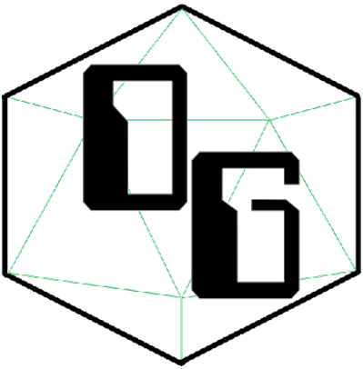

<div align="center">

<!-- Add your project logo if you have any -->


</div>

<h1 align="center">Antsle Labs</h1>

 <p align="center">
 	<!-- Add your tagline or very short intro of your project -->
    A Collection of lab environments, for use with the Antsle One appliance.
    <br />
	<!-- Add your project live demo link here 
    <a href="https://github.com/DeeshanSharma/readme-template">View Demo</a> -->
    ·
	<!-- Add you issue link here 
    <a href="https://github.com/DeeshanSharma/readme-template/issues">Report Bug</a> -->
    ·
	<!-- Add you issue/discussion link here too 
    <a href="https://github.com/DeeshanSharma/readme-template/issues">Request Feature</a> -->
  </p>

<div align="center">

<!-- Use Shields website (link in acknowledgement section) to generate these for your repo or just replace the links here with yours 

[](https://your-live-project-link.com)

[](https://github.com/DeeshanSharma/readme-template/issues)
[](https://github.com/DeeshanSharma/readme-template/network)
[](https://github.com/DeeshanSharma/readme-template/stargazers)

[](https://github.com/DeeshanSharma/readme-template)
-->

</div>

<hr />
<br />

<div align="center">

<!-- Add your project demo gif here -->

<!--  -->

</div>

<!-- You may write notes in your readme this way if you want to, it looks good and also different from other text -->

<!-- >> _**NOTE:** Make sure you include a demo gif of your project (very important) because the reviewer may or may not have time to visit your live project so watching this he/she will get a sneak peak to the project and may visit it later._ -->

<hr />

<!-- <p align="center">Enter your project's introduction here, what it is about, what are the main things used in here for eg: React JS Firebase, how much time it took you to build this, anything special viewer must know</p> -->

## 🧐About

I wanted a repeatable way to build-out testing environments, for script development along with testing of potentially destructive ssytem changes.


## 💡Features

1. Mutilple possible lab configurations
2. Built to utilize the Antsle One hypervisor appliance


## ⛏️Built with

-   Antsle
-   Terraform


## 🏁Getting Started

More to come...


<!-- ## 📚Prerequisite

-   Antsle Appliance
-   Terraform VM

### 🧰Installation

Step by step methods to guide the reader how to setup local dev environment for eg:

1. Clone this repo
1. Install all the dependencies

    ```bash
    yarn
    ```

1. Tweak the code
1. Run on local server

    ```bash
    yarn start
    ```

## 🚀Deployment

List all the steps to deploy the local copy of the project and make it live for eg:

1. Create a new repo
1. Push your code to it
1. Create New Project on your [Vercel Dashboard](https://vercel.com/dashboard)
1. Import your Git Repository
1. After successful import, changes made to the Production Branch (commonly "main/master") will be a Production Deployment and rest all branches will generate Preview Deployments.
1. Once deployed, you will get a URL for your live app, such as: `https://xyz.vercel.app` -->

## 📝Todo

-   Create Windows Domain environment build plan
-   Create Destroy process for easy environment teardown
-   Create CIOT SCADA environment build plan


## 📈Future Plans

-   Simplify the build process, so user can easily expand or shrink the end environment
-   Create GUI for selection of desired environment components


<!-- ## 🎈Usage

Mention how your project could be used and take its advantage or you can include additional screenshots, code examples or anything relevant -->

## ✍️Authors

<!-- Add links to all the authors profile here OPTIONAL: You can mention what they did as well -->

-   [@darkgarage](https://github.com/darkgarage) - Idea & Initial Work

<!-- ## 📖Contributing

**_"In real open source, you have the right to control your own destiny."_** _- Linus Torvalds_

Contributions are what make the open source community an amazing place. Any contributions you make are **greatly appreciated**.

OPTIONAL: Add links to CONTRIBUTING file and CODE OF CONDUCT file if you have them.

## 📢Contributors

It is good to give credit to your contributors as they have given their precious time working on your project so list their name with contact details for eg: -->

<!-- Add links to all the contributors profile here 

-   [@DeeshanSharma](https://www.github.com/DeeshanSharma)

## 💳License

<!-- Mention your project licence here and also link to that file 

Distributed under the MIT License. See [`LICENSE`](LICENCE) for more information.

## 🧬Resources

List all the articles, videos or docs you referred while building this project for eg:

<!-- Add links to all the resources you followed or referred to 

-   [Axios Docs](https://axios-http.com/docs/intro)
-   [Material-UI Docs](https://material-ui.com/getting-started/installation)
-   [Deploy CRA using Vercel Article](https://vercel.com/guides/deploying-react-with-vercel-cra)

## 🎉Acknowledgement

Acknowledge all whose code you used, or took inspiration from or mention any websites you used in the development for eg:

-   [Shields](https://shields.io)
-   [Choose License for your Project](https://choosealicense.com)

## 👋End Note

Did I missed something..? or you have any idea which could be added and will make it better, feel free to contribute I will definitely add that.

Star this Template Repo so that you don't miss it and avoid Googling again, and next time you create new repo use this template and save some time and invest that somewhere else.

I have added comments to the source code of this file to guide you through and help you.

Also you can find a blank template with only comments and no data to start with and refer to this one if you stuck somewhere. -->